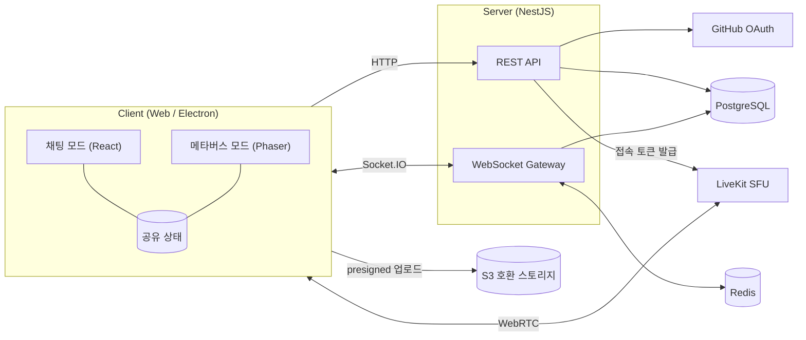
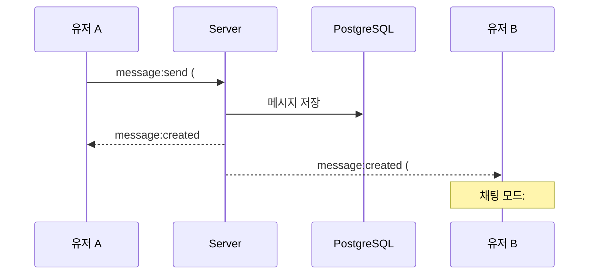

# MetaCode

> 채팅과 메타버스를 한 화면에서. GitHub 계정으로 시작하는 팀·커뮤니티 커뮤니케이션 플랫폼.

MetaCode는 Discord·Slack처럼 **팀/개인 채팅**, **음성 통화**, **커뮤니티**를 제공합니다.
다른 점은 **메타버스 모드**입니다. 커뮤니티마다 광장이 있고, 그 커뮤니티의 온라인 멤버는 모두 캐릭터로 광장에 나타납니다.
누군가 메시지를 보내면 그 사람 캐릭터 위에 말풍선이 떠서, 지금 누가 말하는지 바로 보입니다.

웹 브라우저와 데스크톱 앱(Windows, macOS, Linux)에서 모두 사용할 수 있습니다.

---

## 주요 기능

| 기능 | 설명 |
| --- | --- |
| GitHub 로그인 | GitHub OAuth로 가입/로그인. 프로필(닉네임, 아바타)은 GitHub 계정을 따릅니다. |
| 팀/개인 채팅 | 커뮤니티의 텍스트 채널에서 팀 채팅, 1:1·그룹 DM으로 개인 채팅 |
| 커뮤니티 | 누구나 커뮤니티를 만들고, 초대 링크로 멤버를 받고, 텍스트/음성 채널을 추가할 수 있음 |
| 음성 통화 | Discord처럼 음성 채널에 들어가면 바로 연결. DM에서도 통화 가능. 음소거, 말하는 사람 표시 |
| 근접 음성 | ON이면 광장에서 가까운 캐릭터끼리만 들리고, OFF면 거리와 상관없이 모두 들림. 통화 참여자 누구나 변경 |
| 파일·이미지 첨부 | 채팅에 파일과 이미지를 첨부(기본 최대 50MB)하고, 이미지는 미리보기로 표시 |
| **메타버스 모드** | 커뮤니티와 DM마다 광장이 있고, 캐릭터를 방향키나 마우스로 움직임 |
| **분할 화면** | 지금 보는 채널의 채팅과 그 광장을 VSCode 화면 분할처럼 나란히 띄움 |
| 캐릭터·에셋 | 캐릭터를 고르고 색을 바꿈. 앱 안의 도트 에디터로 캐릭터(개인)와 타일·오브젝트(커뮤니티)를 직접 그림 |
| 맵 에디터 | 커뮤니티 소유자·관리자가 분수 광장에 타일과 오브젝트를 배치 |
| 데스크톱 앱 | 웹 클라이언트를 그대로 감싼 Electron 앱 |
| 계절·행사 테마 (추후) | 계절이나 행사에 맞춰 광장 등의 테마를 바꿈 (예: 겨울에는 눈 덮인 분수 광장) |

## 커뮤니티, 채널, 광장

```
커뮤니티 "MetaCode팀"  →  분수 광장 1개 (커뮤니티 전체가 공유)
├── 텍스트 채널 (# general, # dev ...): 대화 기록을 주제별로 나눔
└── 음성 채널 ((v) lounge, (v) meeting ...): 통화

DM, 그룹 DM  →  모닥불 캠프 1개씩 (대화 기록 + 통화)
```

| 광장 | 속한 곳 | 모습 |
| --- | --- | --- |
| 분수 광장 | 커뮤니티마다 하나 | 분수가 흐르는 넓은 광장 |
| 모닥불 캠프 | DM, 그룹 DM마다 하나 | 모닥불이 타오르는 좁은 야외 공간 |

- 광장에는 **그 커뮤니티(또는 DM) 멤버 중 온라인인 사람 전부**가 나타납니다. 지금 광장을 보고 있지 않아도 나타납니다.
- 분수 광장의 말풍선에는 커뮤니티의 **모든 텍스트 채널** 메시지가 채널 이름과 함께 뜹니다 (예: `[#dev] 안녕`). 내가 읽을 권한이 없는 채널의 메시지는 뜨지 않습니다.
- 캐릭터 위치는 광장마다 따로 유지됩니다. 처음 나타날 때는 스폰 지점에서 시작합니다.

## 채팅 모드와 메타버스 모드

두 모드는 **같은 메시지**를 서로 다르게 보여줍니다. 메시지는 한 번만 저장되고, 모드마다 표현만 다릅니다.

| | 채팅 모드 | 메타버스 모드 |
| --- | --- | --- |
| 목적 | 대화 기록을 남기고 다시 보기 | 누가 지금 말하는지 실시간으로 보기 |
| 보여주는 범위 | 지금 연 채널 하나 | 커뮤니티 전체 (모든 텍스트 채널) |
| 메시지 표시 | 시간순 대화 목록 | 보낸 사람 캐릭터 위 말풍선, 채널 이름 표시 (잠시 뒤 사라짐) |
| 파일 첨부 표시 | 첨부 카드, 이미지 미리보기 | 말풍선 대신 캐릭터 모션 |
| 음성 통화 | 음성 채널 참여자 목록, 말하는 사람 강조 | 캐릭터에 참여 중인 음성 채널 표시, 말할 때 이펙트 |
| 조작 | 메시지 입력 | 방향키 / 마우스 클릭으로 이동 |

### 분할 화면

지금 보는 채널의 **채팅 모드**와, 그 채널이 속한 **광장**을 나란히 띄웁니다. 경계를 드래그해서 크기를 조절하고, 한쪽만 켤 수도 있습니다.

```
┌───────────┬─────────────────────────┬─────────────────────────┐
│ Sidebar   │ Chat (# dev)            │ Plaza (MetaCode team)   │
│           │                         │                         │
│ MetaCode  │ alice: hello            │   [#dev] hello          │
│  # general│ bob:   hi!              │      (A)       ~~~      │
│  # dev    │ alice: [image.png]      │ [#general] lunch?       │
│ (v) lounge│                         │    (C)      fountain    │
│ DM        │                         │         (B)             │
│  @ carol  │ > message input_        │   arrows / click: move  │
└───────────┴─────────────────────────┴─────────────────────────┘
                         ↔ 경계를 드래그해서 크기 조절
```

여러 채널을 동시에 나눠 보는 기능은 나중에 별도 기능으로 추가합니다.

### 음성 채널과 근접 음성

- 음성 채널에 들어가도 캐릭터는 커뮤니티 광장에 그대로 있습니다. 광장에서는 캐릭터마다 참여 중인 음성 채널이 표시됩니다.
- 한 사람은 동시에 통화 하나에만 참여합니다 (Discord와 동일).
- 근접 음성은 음성 채널(또는 DM 통화)마다 켜고 끄며, 그 통화 참여자 누구나 바꿀 수 있습니다.

| 설정 | 동작 |
| --- | --- |
| OFF (기본) | 같은 음성 채널 참여자 모두의 목소리가 거리와 상관없이 들림 |
| ON | 같은 음성 채널 참여자 중 광장에서 가까운 사람의 목소리만 들림. 가까울수록 크게 들림 |

다른 음성 채널 참여자의 목소리는 광장에서 아무리 가까워도 들리지 않습니다.

### 도트 에셋 규격

| 항목 | 원본 크기 | 기본 화면 크기 (3배) |
| --- | --- | --- |
| 타일 | 16×16px | 48×48px |
| 캐릭터 한 프레임 | 해상도는 가로 16~128px, 세로는 가로의 2배 (기본 16×32px) | 48×96px (해상도와 무관하게 늘 1타일×2타일) |
| 모닥불 캠프 맵 | 약 16×12타일 | 맵 전체가 한 화면에 보임 |
| 분수 광장 맵 | 약 48×36타일 이상 | 카메라가 내 캐릭터를 따라감 |

- 화면에는 정수배(2~4배, 기본 3배)로만 확대합니다.
- 캐릭터 해상도는 받아 온 에셋을 줄이지 않고 쓰려고 범위로 열어 두었습니다. 광장에서 차지하는 크기는 해상도와 상관없이 늘 1타일×2타일이라, 해상도를 올리면 같은 자리에 더 촘촘하게 그려집니다.
- 캐릭터 기준점은 발밑 가운데입니다. 스프라이트시트는 행이 방향(아래, 왼쪽, 오른쪽, 위), 열이 프레임입니다.
- 에셋은 앱 안의 도트 에디터로 그립니다 (PNG 가져오기·내보내기로 Aseprite 같은 외부 도구와 주고받기). 기본 지형과 캐릭터는 CC0 에셋팩으로 만들었습니다 ([assets/CREDITS.md](assets/CREDITS.md)).

### 테마

계절이나 행사에 맞춰 광장의 겉모습을 바꿀 수 있게 합니다. 테마 기능은 나중에 만들지만, 맵과 에셋은 처음부터 테마를 바꿀 수 있는 구조로 만듭니다.

- 맵은 **배치**(크기, 충돌 영역, 스폰 지점)와 **겉모습**(타일셋, 장식)으로 나눕니다. 테마는 겉모습만 바꿉니다.
- 같은 맵의 테마별 타일셋은 칸 배치를 똑같이 그립니다. 예를 들어 기본 테마의 잔디 칸 자리에 겨울 테마는 눈 덮인 땅을 그립니다. 그러면 맵 파일 하나로 모든 테마를 쓸 수 있습니다.
- 크리스마스 트리처럼 특정 테마에만 있는 장식은 별도 레이어에 두고, 캐릭터 이동을 막지 않게 합니다.

---

## 기술 스택

2026-09-26 확정. 버전은 Phase 0 스캐폴딩 시점 기준입니다. 아직 설치하지 않은 라이브러리는 그 기능을 만드는 Phase에서 추가합니다.

| 영역 | 기술 | 이유 |
| --- | --- | --- |
| 언어 | TypeScript 6.0 (전 영역) | 클라이언트와 서버가 타입, 이벤트 규격을 공유 |
| 모노레포 | pnpm workspaces + Turborepo | 앱/공용 패키지 분리, 빌드 캐싱 |
| 프론트엔드 | React 19 + Vite 8 | 채팅 UI, 레이아웃 |
| 데스크톱 | Electron 44 | 모든 OS에서 같은 Chromium을 써서 WebRTC(통화, 화면 공유)가 똑같이 동작. Discord, Slack도 같은 방식 |
| 상태 관리 | Zustand + TanStack Query | 클라이언트 상태와 서버 상태 분리 |
| 메타버스 렌더링 | Phaser 4 | 2D 탑다운 광장, 타일맵, 스프라이트 애니메이션, 입력 처리 내장 |
| 분할 화면 | react-resizable-panels | VSCode식 크기 조절 패널 |
| 백엔드 | Node.js 24 + NestJS 12 (ESM) | 모듈 단위 구조(인증, 채팅, 광장, 음성), WebSocket 게이트웨이 |
| 실시간 통신 | Socket.IO (+ Redis adapter) | 방 단위 브로드캐스트, 서버 수평 확장 |
| DB | PostgreSQL 17 + Prisma 7 | 커뮤니티, 채널, 메시지 같은 관계형 데이터 |
| 캐시·Presence | Redis | 온라인 상태, 광장 위치 같은 휘발성 데이터, pub/sub |
| 파일 저장소 | SeaweedFS (S3 호환, 셀프 호스팅) | presigned URL로 클라이언트가 직접 업로드. AWS S3 없이 서버에서 직접 운영 |
| 운영 | Oracle Cloud Ubuntu + Docker Compose + Caddy | 서버 한 대에서 전체 운영, Caddy가 HTTPS 인증서 자동 발급 |
| 음성 통화 | LiveKit (WebRTC SFU) | 다자간 음성, 참여자별 구독 제어(근접 음성), 오픈소스라 셀프 호스팅 가능 |
| 인증 | GitHub OAuth 2.0 + JWT | 웹은 HttpOnly 쿠키, 데스크톱은 루프백(`127.0.0.1`)으로 로그인 완료 |
| 검증 | zod | 클라이언트/서버 공용 스키마 |
| 테스트 | Vitest 5, Playwright | 단위 테스트 / E2E |

## 아키텍처



### 메시지 한 개가 두 모드에 표시되는 과정



## 프로젝트 구조 (예정)

```
MetaCode/
├── apps/
│   ├── web/              # 클라이언트 (채팅 모드 + 메타버스 모드)
│   ├── desktop/          # Electron 셸 (web 빌드를 감쌈)
│   └── server/           # REST API + WebSocket 게이트웨이
├── packages/
│   └── shared/           # 공용 타입, 소켓 이벤트 규격, zod 스키마
├── assets/
│   ├── vendor/           # CC0 원본 (Kenney Tiny Town, base sprites)
│   └── CREDITS.md        # 에셋 출처
├── tools/
│   ├── build-assets.mjs  # 원본 + 직접 그린 것 → 내장 에셋 JSON (packages/shared)
│   └── assets/           # 분수·모닥불 등 직접 그리는 코드, 캐릭터 옷 입히기
├── infra/
│   ├── docker-compose.yml       # 개발용: PostgreSQL, Redis, SeaweedFS(S3)
│   ├── docker-compose.prod.yml  # 운영용: + Caddy(HTTPS), 서버, 마이그레이션
│   ├── caddy/                   # Caddyfile, 웹 빌드를 담은 Caddy 이미지
│   └── backup.sh                # 운영 DB 백업
└── docs/
    └── deploy.md                # 운영 서버 배포 안내
```

---

## 로드맵

각 Phase는 이전 Phase가 끝난 뒤 시작합니다. 핵심 차별점인 메타버스 모드를 음성 통화보다 먼저 만듭니다.
데스크톱 앱은 처음부터 함께 띄워서 확인합니다. 로그인 같은 흐름이 웹과 다르기 때문입니다.

### Phase 0: 프로젝트 기반
- [x] 기술 스택 확정
- [x] 모노레포 스캐폴딩 (`apps/web`, `apps/desktop`, `apps/server`, `packages/shared`)
- [x] Electron 셸: 개발 모드에서 web 개발 서버를 띄우고, 보안 설정(contextIsolation 등) 적용
- [x] TypeScript, ESLint, Prettier 설정
- [x] Docker Compose 로컬 인프라 (PostgreSQL, Redis, SeaweedFS)
- [x] GitHub Actions CI (format, lint, typecheck, test, build)
- [x] `.env.example` 작성

### Phase 1: 인증과 사용자
- [x] GitHub OAuth 로그인 / 로그아웃 (웹)
- [x] 데스크톱 로그인: 시스템 브라우저로 GitHub 인증 → 루프백(`127.0.0.1`)으로 앱 복귀
- [x] JWT 발급, 갱신
- [x] 사용자 프로필 (GitHub 닉네임, 아바타 연동)
- [x] 온라인 상태(Presence): WebSocket 연결 기준
- [x] 운영용 구성 (Docker Compose + Caddy HTTPS, 백업 스크립트, 배포 안내서)
- [x] Oracle Cloud 서버에 첫 배포 ([docs/deploy.md](docs/deploy.md)): https://metacode.kimyangmin.me

### Phase 2: 채팅 모드 MVP
- [x] 기본 레이아웃 (커뮤니티 막대 + 사이드바 + 채팅 패널 + 멤버 목록)
- [x] 커뮤니티 생성, 초대 링크, 참여/탈퇴, 삭제
- [x] 커뮤니티 안에 텍스트 채널 생성
- [x] 1:1 DM, 그룹 DM, 사용자 검색
- [x] 실시간 메시지 송수신, 기록 저장, 이전 기록 불러오기 (무한 스크롤)
- [x] 입력 중 표시, 읽음 처리, 멤버 온라인 표시

### Phase 3: 파일·이미지 첨부
- [x] presigned URL 업로드 (S3 호환 스토리지, 진행률 표시, 📎 버튼·붙여넣기·끌어 놓기)
- [x] 이미지 미리보기, 썸네일(서버에서 WebP로 생성), 크게 보기, 파일 다운로드
- [x] 파일 크기 제한 (기본 50MB, 서버 설정으로 변경 가능), 실행 파일 차단, 메시지당 10개

### Phase 4: 메타버스 모드 MVP
- [x] 분할 화면 레이아웃 (지금 보는 채널의 채팅 | 그 광장, 크기 조절, 패널별 켜기/끄기)
- [x] 광장 씬: 커뮤니티마다 분수 광장, DM마다 모닥불 캠프 (에셋 전까지는 플레이스홀더 맵)
- [x] 맵 로딩을 배치 + 테마별 겉모습으로 분리 (처음에는 `default` 테마만)
- [x] 플레이스홀더 캐릭터 + 방향키 이동, 마우스 클릭 지점 이동
- [x] 광장 인원 = 커뮤니티(또는 DM) 멤버 중 온라인 전원, 광장별 위치 유지, 스폰 지점
- [x] 위치 동기화 (서버 검증, 클라이언트 보간)
- [x] 메시지 → 말풍선 (모든 텍스트 채널, 채널 이름 표시, 읽기 권한 반영, 표시 시간, 긴 메시지 줄임, 연속 메시지 처리)
- [x] 첨부 메시지 → 임시 표시 (Phase 6에서 첨부 모션으로 교체)
- [x] 키보드 포커스 분리 (채팅 입력 중에는 캐릭터가 움직이지 않음)

### Phase 5: 음성 통화
- [x] LiveKit 연동, 커뮤니티 음성 채널 생성, 참여/나가기 (동시에 통화 하나만)
- [x] DM 통화
- [x] 마이크 음소거, 헤드셋 끄기, 입출력 장치 선택
- [x] 말하는 사람 표시 (채팅 모드 참여자 목록 + 광장 캐릭터 이펙트)
- [x] 광장 캐릭터에 참여 중인 음성 채널 표시
- [x] 근접 음성 ON/OFF (통화마다 설정, 참여자 누구나 변경, 거리 기반 구독, 거리에 따른 볼륨 감쇠)
- [x] (선택) 화면 공유

### Phase 6: 캐릭터·맵 에셋
- [x] 에셋·맵 형식 정의 (팔레트 픽셀 + 애니메이션, 타일의 통행 불가, 오브젝트의 막힌 칸, 캐릭터의 색 부위). 내장 에셋: Kenney Tiny Town 타일(CC0), 직접 그린 분수·모닥불 등, base sprites(CC0)에 옷을 입힌 기본 캐릭터 ([assets/CREDITS.md](assets/CREDITS.md))
- [x] 분수 광장, 모닥불 캠프 맵의 `default` 테마 적용 (분수, 모닥불, 물 애니메이션)
- [x] 캐릭터 대기, 걷기 애니메이션 (4방향, 사용자마다 기본 캐릭터와 색)
- [x] 첨부 모션 애니메이션 (손 흔들기 + 제자리 뛰기, Phase 4의 임시 표시 교체)
- [x] 도트 에디터: 설정의 에셋 목록에서 캐릭터(개인)와 타일·오브젝트(커뮤니티)를 직접 그림. 캐릭터는 필수 애니메이션을 다 그려야 저장 (PNG 가져오기·내보내기, 올가미 선택·옮기기·복사, 자르기, 캐릭터 발 아래 빈 줄 자동 정리)
- [x] 캐릭터 선택/커스터마이징 UI (설정 → 캐릭터: 기본 캐릭터 부위별 색 바꾸기, 직접 그린 캐릭터)
- [x] 맵 에디터: 커뮤니티 소유자·관리자가 분수 광장에 타일과 오브젝트를 배치 (설정 → 에셋 → 광장 맵 편집, 저장하면 광장에 바로 반영)

### Phase 7: 안정화와 배포
- [x] 메시지 수정·삭제 (내 메시지, 우클릭 메뉴, 광장 말풍선에도 반영)
- [ ] 멘션, 알림(데스크톱 네이티브 알림 포함), 메시지 검색
- [x] 커뮤니티 권한/역할 (관리자, 멤버, 사용자 정의 역할, 비공개 채널)
- [x] 사용자 설정: 닉네임·자기소개·프로필 사진, 음성 장치·마이크 증폭·출력 음량
- [x] 커뮤니티 설정: 이름·아이콘·배너, 광장 에셋(타일·오브젝트, 맵 편집), 커뮤니티 삭제(이름 입력 확인)
- [ ] 광장 동시 접속 부하 테스트
- [ ] 운영 서버 백업 자동화, 모니터링
- [ ] 데스크톱 앱 배포: 설치 파일, 자동 업데이트, 코드 서명 (설치 파일·자동 업데이트·초대 링크로 앱 열기 완료, 코드 서명은 정식 공개 때)

### 추후 기능
- 여러 채널을 동시에 나눠 보는 멀티 분할 화면
- 계절·행사 테마 (테마 추가, 테마 전환 방식)

---

## 개발 프로세스

### 브랜치 전략

```
main      배포 브랜치. dev에서 검증된 것만 병합
 └─ dev   통합 브랜치. 모든 기능 브랜치가 여기로 병합
     └─ feature/<요약>   기능 단위 작업 브랜치 (예: feature/github-oauth)
     └─ fix/<요약>       버그 수정
```

- 작업은 항상 `dev`에서 브랜치를 따서 시작하고, PR로 `dev`에 병합합니다.
- `main`에는 직접 커밋하지 않습니다.

### 커밋 메시지

[Conventional Commits](https://www.conventionalcommits.org/)를 따릅니다.

```
<type>(<scope>): <설명>

feat(chat): 채널 메시지 무한 스크롤 추가
fix(plaza): 광장 퇴장 시 캐릭터가 남아있는 문제 수정
```

- `type`: `feat`, `fix`, `refactor`, `docs`, `test`, `chore`, `style`, `perf`
- `scope`: `auth`, `chat`, `community`, `channel`, `plaza`, `voice`, `upload`, `desktop`, `shared`, `infra` 등

### PR 규칙
- PR 하나에 기능 하나. 로드맵 항목 단위로 나눕니다.
- CI(lint, typecheck, test)를 통과해야 병합합니다.
- 기능을 끝내면 이 README의 로드맵 체크박스를 갱신합니다.

---

## 시작하기

개발 환경 설정입니다. 운영 서버 배포는 [docs/deploy.md](docs/deploy.md)를 봅니다.

### 필요한 도구

- Node.js 22 이상 (24 권장, `.nvmrc` 참고)
- pnpm 10 (`corepack enable`로 켜면 `package.json`에 적힌 버전을 씀)
- Docker (로컬 DB, Redis, 파일 저장소)

### 처음 설정

```bash
pnpm install
```

```bash
cp .env.example .env
```

```bash
pnpm infra:up
```

`pnpm infra:up`은 PostgreSQL(5433), Redis(6379), SeaweedFS(S3 API 9000), LiveKit(음성, 7880 · 7881 · 7882/udp)을 띄우고 첨부 파일 버킷을 만듭니다. `.env.example`의 LiveKit 키는 로컬 LiveKit에 맞춰져 있습니다.

DB 테이블을 만듭니다 (스키마가 바뀔 때마다 다시 실행):

```bash
pnpm --filter @metacode/server db:migrate
```

`.env`에 `JWT_SECRET`을 채웁니다 (32자 이상 무작위 값):

```bash
openssl rand -base64 48
```

### GitHub 로그인 설정

GitHub에서 **OAuth App**을 만들고 값을 `.env`에 넣어야 로그인할 수 있습니다. 비워 두면 서버는 뜨지만 로그인 버튼이 동작하지 않습니다.

1. GitHub → Settings → Developer settings → OAuth Apps → **New OAuth App**
2. 다음과 같이 입력합니다.

   | 항목 | 값 |
   | --- | --- |
   | Application name | `MetaCode (dev)` |
   | Homepage URL | `http://localhost:5173` |
   | Authorization callback URL | `http://localhost:3000/auth/github/callback` |

3. 만든 앱의 **Client ID**와, **Generate a new client secret**으로 만든 값을 `.env`의 `GITHUB_CLIENT_ID`, `GITHUB_CLIENT_SECRET`에 넣습니다.

GitHub OAuth App은 콜백 URL을 하나만 받으므로, 운영 서버용 앱은 따로 만듭니다.

### 개발 서버

```bash
pnpm dev
```

웹(http://localhost:5173)과 서버(http://localhost:3000)가 뜹니다. 데스크톱 앱까지 함께 띄우려면:

```bash
pnpm dev:desktop
```

### 여러 사용자로 확인하기

실제 GitHub 없이 여러 계정으로 로그인하려면 가짜 GitHub(`tools/fake-github.mjs`)를 띄우고 서버를 그쪽으로 연결합니다. 인증 화면에서 앨리스, 밥, 캐롤 중 하나를 고를 수 있습니다. 서로 다른 브라우저(또는 시크릿 창)에서 각각 로그인하면 됩니다.

```bash
node tools/fake-github.mjs
```

```bash
GITHUB_OAUTH_URL=http://localhost:4010 GITHUB_API_URL=http://localhost:4010 GITHUB_CLIENT_ID=dev GITHUB_CLIENT_SECRET=dev pnpm dev
```

### 데스크톱 설치 파일 만들기

```bash
pnpm --filter @metacode/desktop dist:win    # Windows: MetaCode-Setup-<버전>.exe
pnpm --filter @metacode/desktop dist:mac    # macOS: MetaCode-<버전>-mac-{arm64,x64}.dmg (Mac에서만)
pnpm --filter @metacode/desktop dist:linux  # Linux: .AppImage, .deb
```

`apps/desktop/release/`에 만들어집니다. 설치한 앱은 운영 사이트(`https://metacode.kimyangmin.me`)를 앱 창에서 열므로, 서버를 배포하면 앱 화면도 바로 최신이 됩니다. 앱이 바뀌는 것은 데스크톱 기능(로그인, 권한, 첨부 받기, 화면 공유 등)을 바꿨을 때뿐이고, 그때는 아래처럼 새 버전을 내면 설치한 앱이 스스로 업데이트합니다.

- 코드 서명 인증서가 없어서 처음 실행할 때 Windows가 "Windows의 PC 보호" 창을 띄웁니다. **추가 정보 → 실행**을 누르면 됩니다.
- 관리자 권한 없이 현재 사용자 계정에 설치됩니다 (`%LOCALAPPDATA%\Programs` 아래). 제거는 Windows 설정의 앱 목록에서 합니다.
- macOS 설치 파일은 Mac에서만 만들 수 있습니다. Apple 개발자 서명 없이 임시(ad-hoc) 서명만 해서, 처음 열 때 "확인되지 않은 개발자" 경고가 뜨면 **시스템 설정 → 개인정보 보호 및 보안 → 그래도 열기**를 누릅니다 (또는 `xattr -dr com.apple.quarantine /Applications/MetaCode.app`). 코드 서명은 정식 공개 때 다시 정합니다.
- Linux는 AppImage(실행 권한을 주고 바로 실행)와 deb(Debian·Ubuntu)를 만듭니다.
- 사용자에게 나눠 줄 설치 파일은 아래처럼 GitHub Actions가 만들어 Releases에 올립니다. 이 명령은 손으로 확인할 때 씁니다.

### 데스크톱 앱 새 버전 내기 (자동 업데이트)

0.3.0부터 설치한 Windows 앱은 스스로 업데이트합니다. 켤 때와 4시간마다 [GitHub Releases](https://github.com/kimyangmin/MetaCode/releases/latest)의 최신 버전을 확인하고, 새 버전을 백그라운드에서 받아 두었다가 앱 화면 위의 **다시 시작**을 누르거나 앱을 끌 때 설치합니다. Linux AppImage도 같습니다. 서명하지 않은 macOS 앱과 deb로 설치한 Linux 앱은 스스로 설치할 수 없어서 **새 버전 받기** 안내만 띄웁니다.

1. `apps/desktop/package.json`의 `version`을 올려서 `main`에 병합합니다.
2. 그 커밋에 `desktop-v<버전>` 태그를 달아 push합니다.
   ```bash
   git tag desktop-v0.3.1 && git push origin desktop-v0.3.1
   ```
3. `Desktop Release` 워크플로가 Windows·macOS·Linux 러너에서 각각 설치 파일, `.blockmap`, `latest.yml`/`latest-mac.yml`/`latest-linux.yml`을 만들고, 모두 끝나면 Release 하나로 올립니다 (태그와 package.json 버전이 다르면 실패하고, 한 OS라도 실패하면 올리지 않습니다).

- 앱은 저장소의 **최신(Latest) Release**를 봅니다. 이 저장소에 데스크톱 외의 Release를 올리면 그것이 최신이 되어 업데이트 확인이 실패하므로, 다른 Release는 올리지 않거나 Latest로 표시하지 않습니다.
- 앱 화면은 운영 사이트를 열기 때문에 웹만 바꾼 경우에는 새 버전을 낼 필요가 없습니다. 메인 프로세스나 preload(`apps/desktop/src`)를 바꿨을 때만 냅니다.
- 0.2.0 이하 앱에는 자동 업데이트가 없어서 한 번은 Releases에서 받아 설치해야 합니다. 앱 화면에 "새 버전 받기" 안내가 뜹니다.

### 자주 쓰는 명령어

| 명령어 | 설명 |
| --- | --- |
| `pnpm build` | 전체 빌드 |
| `pnpm typecheck` | 전체 타입 검사 |
| `pnpm test` | 전체 테스트 |
| `pnpm lint` | ESLint |
| `pnpm format` / `pnpm format:check` | Prettier 적용 / 검사 |
| `pnpm infra:up` / `pnpm infra:down` | 로컬 인프라 시작 / 중지 |
| `pnpm --filter @metacode/server db:migrate` | 스키마 변경을 마이그레이션으로 만들고 로컬 DB에 적용 |
| `pnpm --filter @metacode/server db:studio` | DB 내용을 브라우저에서 보기 (Prisma Studio) |
| `pnpm assets:build` | 내장 에셋(타일, 오브젝트, 기본 캐릭터) 다시 만들기 |

`pnpm test`의 서버 테스트는 실제 PostgreSQL과 Redis를 쓰므로 `pnpm infra:up`이 먼저 필요합니다. 개발 DB는 건드리지 않고 `metacode_test` DB와 Redis 1번 DB를 따로 씁니다.
